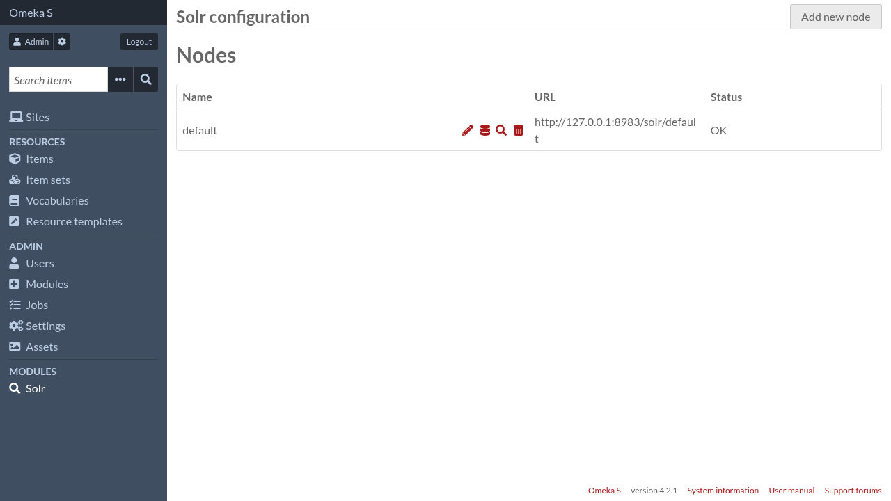

Configuration
=============

.. note:: Only global administrators and supervisors are allowed to change Solr
   configuration

Configuration is organized around "nodes". In the context of this module, a
node represents a Solr collection (if Solr is running in SolrCloud) or core (if
running in user-managed mode).

You can have as many nodes as you want, but it is an error to have several
nodes represent the same Solr collection/core.

On most Omeka S installations, a single node will be enough.

A Solr node in Omeka S holds all the configuration related to that specific
Solr collection/core. Things like:

- Indexation settings (what pieces of Omeka S data get indexed into Solr documents)
- Search settings (what kind of search fields are made available to the Search module)
- Other Solr specific settings like default query fields (``qf``), "minimum
  should match" (``mm``), highlighting parameters, ...

Installing the Solr module automatically creates a node with default settings
for easier setup. To start configuring it, go to the administration interface
and in the navigation menu, click on "Solr".

From there you can:

- add a new node by clicking on the "Add new node" button at the top of the page,
- edit the existing :doc:`node settings <configuration/node-settings>` by clicking on the pencil icon,
- edit the :doc:`indexation fields <configuration/indexation-fields>` by clicking on the database icon,
- edit the :doc:`search fields <configuration/search-fields>` by clicking on the magnifying glass icon,
- delete a Solr node by clicking on the trash icon

.. toctree::
   :hidden:

   configuration/node-settings
   configuration/indexation-fields
   configuration/search-fields
